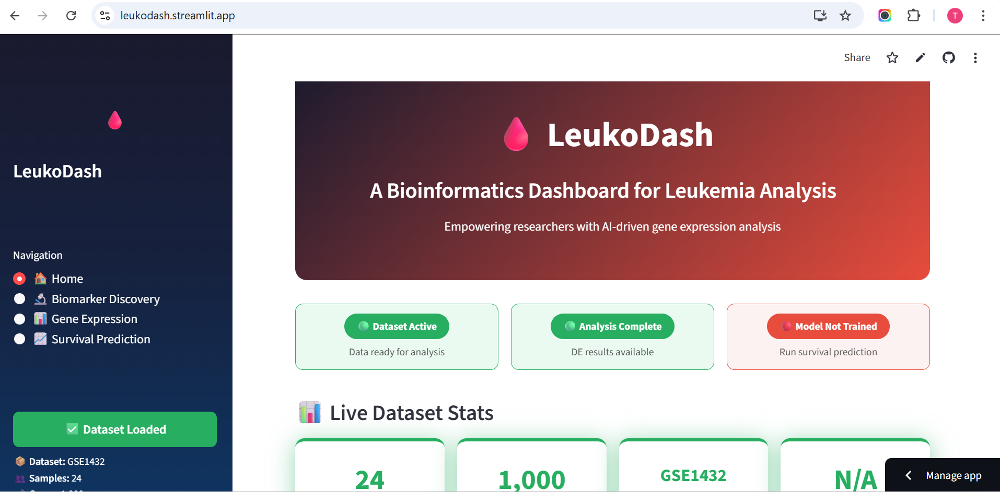
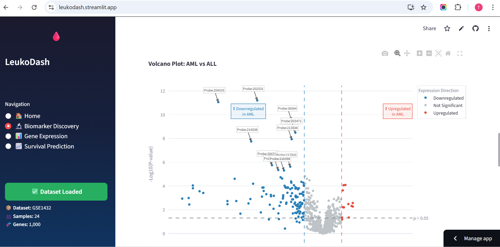
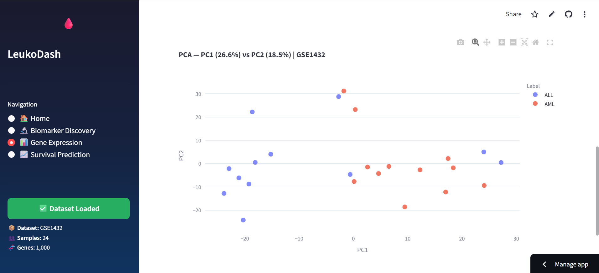
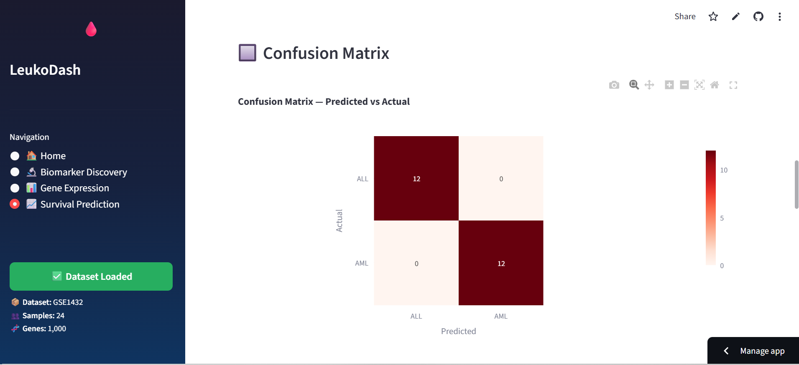

<div align="center">

# 🩸 LeukoDash

### AI-Powered Leukemia Gene Expression Analysis Dashboard

[](https://leukodash.streamlit.app)
[](https://python.org)
[](https://streamlit.io)
[](LICENSE)
[](https://uaf.edu.pk)

> 🎓 *Final Year Project — University of Agriculture, Faisalabad (UAF)*

**LeukoDash** is a no-code bioinformatics web dashboard for 
end-to-end leukemia gene expression analysis — from raw GEO 
data to biomarker discovery, expression visualization, pathway 
enrichment, and ML-based cancer classification — all through 
an intuitive visual interface with zero coding required.

</div>

---

## ⚡ Try it in 60 Seconds

1. Open **[leukodash.streamlit.app](https://leukodash.streamlit.app)**
2. Go to **Biomarker Discovery** in the sidebar
3. Type `GSE1432` and click **Fetch Dataset**
4. Select first 12 samples as **Group 1 (ALL)** 
   and last 12 samples as **Group 2 (AML)**
5. Click **Run Differential Expression Analysis**
6. Explore your volcano plot, pathway enrichment, 
   PCA, and ML prediction results instantly

---

## 🌟 Key Highlights

| Feature | Details |
|--------|---------|
| 🧬 Dataset | Golub et al. (1999) — 72 patients, 7,129 genes |
| 🎯 ML Accuracy | Up to 91.7% cross-validated on ALL vs AML |
| 🧪 Analysis Modules | 3 fully integrated scientific modules |
| 🌐 GEO Integration | Fetch any public dataset from NCBI GEO |
| 💻 No Coding Required | Fully interactive web interface |
| ☁️ Cloud Deployed | Live on Streamlit Cloud |
| ⚙️ Memory Optimized | Float32 + chunked loading — crash-free |
| 🎛️ Interactive Thresholds | Live p-value and log2FC sliders |

---

## 📸 Screenshots

### 🏠 Home Dashboard


### 🌋 Volcano Plot with Threshold Sliders


### 🔵 PCA Clustering


### 🔲 Confusion Matrix


---

## 🔬 Modules

### 🧫 Module 1 — Biomarker Discovery

> Identify statistically significant leukemia biomarkers 
> using differential expression analysis.

<details>
<summary>📌 <b>See full feature list</b></summary>

<br>

**Data Input:**
- 🌐 Fetch any public dataset from **NCBI GEO** by accession 
  number (e.g. `GSE1432`, `GSE13159`)
- 📁 Upload your own gene expression CSV file
- ⚙️ Sample subsetting option for large datasets (>500 samples)

**Analysis:**
- Define two sample groups (e.g. ALL vs AML)
- Fully **vectorized t-test** across all genes simultaneously
  (60x faster than loop-based approach)
- Calculates **Log2 Fold Change**, **p-value**, significance
- Classifies genes as **Upregulated**, **Downregulated**, 
  or **Not Significant**
- Auto-removes zero-variance (dead) genes before analysis

**Interactive Thresholds:**
- 🎛️ Live **p-value slider** (0.001 to 0.1)
- 🎛️ Live **log2FC slider** (0.5 to 3.0)
- Volcano plot and gene counts update instantly

**Visualizations:**
- 🌋 **Volcano Plot** — WebGL rendered, color-coded, 
  quadrant labels, probe ID cleaning
- 🧬 **Top 20 Significant Genes Table**
- 🧠 **Biological Interpretation Box** — auto-explains 
  results in plain language

**Pathway Enrichment:**
- 🔗 Maps significant genes to **KEGG biological pathways** 
  via **Enrichr** (gseapy)
- Top 10 enriched pathways as interactive bar chart

**Downloads:**
- ⬇️ Full DE results (CSV)
- ⬇️ Significant genes only (CSV)
- ⬇️ Full analysis report (CSV)

</details>

---

### 📊 Module 2 — Gene Expression Visualization

> Explore expression patterns, cluster patients, 
> and visualize gene activity across samples.

<details>
<summary>📌 <b>See full feature list</b></summary>

<br>

**Data Input:**
- 📦 Use Golub dataset (default)
- 🔄 Reuse GEO loaded data from Biomarker module
- 📁 Upload your own CSV

**Visualizations:**
- 🔥 **Interactive Heatmap** — adjustable top-N variable 
  genes, Z-score normalized, RdBu color scale
- 🔵 **PCA** — with explained variance % on axes
- 🌀 **t-SNE** — with automatic PCA pre-reduction for speed
- 🔲 **K-Means Clustering** — adjustable clusters (2–6), 
  overlaid on PCA axes

All scatter plots use **WebGL rendering** for smooth 
performance even with large datasets.

</details>

---

### 📈 Module 3 — Survival Prediction

> Predict leukemia subtype (ALL vs AML) using machine 
> learning with cross-validated accuracy.

<details>
<summary>📌 <b>See full feature list</b></summary>

<br>

**ML Model Training:**
- Choose from 3 models:
  - 🌲 **Random Forest**
  - 📐 **Logistic Regression**
  - ⚡ **Support Vector Machine (SVM)**
- Adjustable top genes (100–1000)
- **5-Fold Stratified Cross Validation**

**Results:**
- 📊 CV accuracy bar chart with mean line
- 🔢 **Confusion Matrix**
- 📋 Full **Classification Report** (precision, recall, F1)
- 🧬 **Top 20 Gene Importances** (Random Forest only)
- 🧠 **Model Interpretation Box** — rates performance 
  as Excellent, Moderate, or Low automatically

**Individual Patient Prediction:**
- 🩺 Select any sample and predict ALL or AML
- Shows prediction confidence score per class

**Downloads:**
- ⬇️ Classification report (CSV)
- ⬇️ Gene importances (CSV)

</details>

---

## 🧠 Technical Highlights

| Optimization | Implementation |
|---|---|
| Memory | Float32 conversion — 50% RAM reduction |
| Speed | Vectorized NumPy t-tests — 60x faster |
| Caching | @st.cache_data on all heavy functions |
| Stability | Chunked file processing — no memory spikes |
| Plots | WebGL rendering for 10,000+ data points |
| Errors | Clean messages for all failure cases |

---

## 🧬 Dataset

> **Golub et al. (1999)** — *Molecular Classification of Cancer: 
> Class Discovery and Class Prediction by Gene Expression 
> Monitoring* — Science

| Property | Value |
|----------|-------|
| 👥 Samples | 72 patient samples |
| 🧬 Features | 7,129 gene expression values |
| 🏷️ Classes | ALL & AML Leukemia |
| 📦 Source | [Kaggle](https://kaggle.com/datasets/crawford/gene-expression) |

The app also supports any public GEO dataset via accession number.

---

## 🛠️ Built With


| Library | Purpose |
|---------|---------|
| `Streamlit` | Web app framework |
| `Scikit-learn` | ML models, PCA, t-SNE, K-Means |
| `SciPy` | Vectorized t-test for DE analysis |
| `Plotly` | Interactive WebGL charts |
| `gseapy` | KEGG pathway enrichment via Enrichr |
| `Lifelines` | Kaplan-Meier survival analysis |
| `requests + gzip` | Lightweight GEO series matrix fetching |
| `Pandas / NumPy` | Data processing (float32 optimized) |

---

## 🚀 Run Locally

```bash
# 1. Clone the repository
git clone https://github.com/talha-sa/LeukoDash.git
cd LeukoDash

# 2. Install dependencies
pip install -r requirements.txt

# 3. Launch the app
streamlit run app.py
```

> 💡 Python 3.9+ recommended

---

## 👨‍💻 Developer

<div align="center">

**Talha Saleem**

BSc Bioinformatics — University of Agriculture, Faisalabad (UAF) · 2022–2026

[](https://linkedin.com/in/talha-sa)
[](https://github.com/talha-sa)
[](https://leukodash.streamlit.app)

</div>

---

<div align="center">

*Made with ❤️ for bioinformatics research | UAF Final Year Project 2025-2026*

</div>